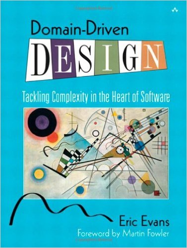
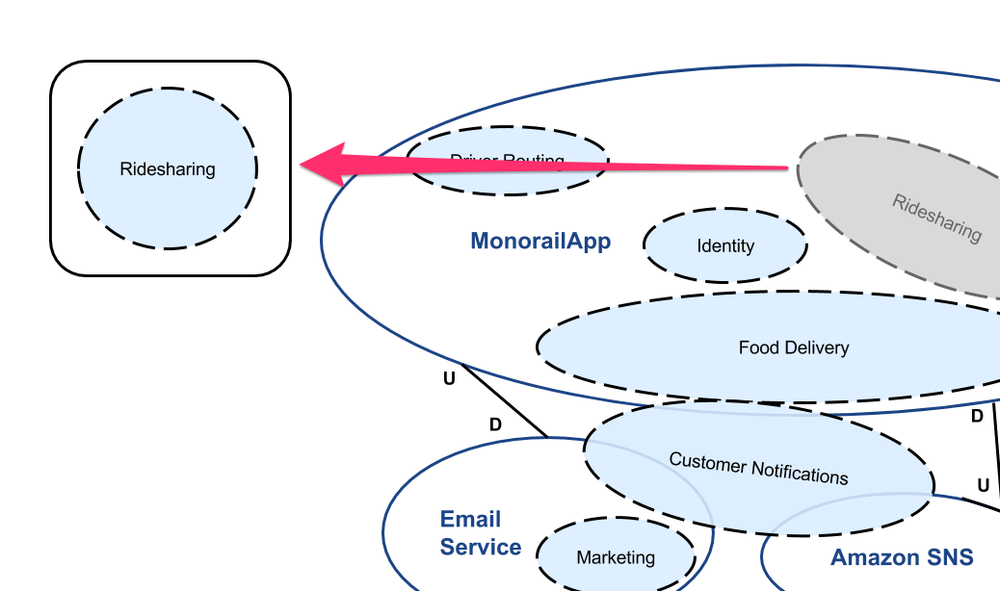

class: middle

&nbsp;

# Built to Last

#### A domain-driven approach to beautiful systems

Andrew Hao<br />
andrew@carbonfive.com


---

class: middle background-color-delorean

## Welcome to your first day at Delorean! 🚗💥🕖

It's like Uber... for time travel!

???

Welcome to your very first day at Delorean! Together, we are
revolutionizing the very industry of time travel! With one touch on our
app, you can now summon a driver to whisk you away to any time period
you wish.

We're changing the world, indeed.

---

class: background-color-delorean

## And it's a hot mess!

We moved a teensy bit too fast:

1. Too many teams in one codebase

???
Oh by the way, I should mention you might be a little surprised when
you open our monolithic codebase. It's just got a few little quirks
I'm sure you won't mind, heh heh. I mean, we have a lot of teams working
on this codebase, so there's gonna be a lot of commits flying through at
once.

--
2. Changing a feature changes multiple codebases

???
We have several of these big ol codebases, so our features are going to
have to be coded across several systems to coordinate a big release! No
big deal, you'll get used to it.

--
3. Concepts inconsistently named

???
Finally, there are some funny naming conventions here and there, so when
your PO tells you about the FizzBangWidget, just don't forget it's
actually the FooBarDoohickey which someone named the BarThingamabobber a
few years ago. Don't worry, he's not with the company anymore, haha!
That's another story for another time.

--
4. Ship, ship, ship! (No time to refactor)

???
I know what you're thinking, you're thinking we need to fix things up a
little bit around here. Well I can assure you we have plans to do
something about it right around the corner, but for now we've really got
to ship our newest feature, Puppy Deliveries. Your team will fill you in
on it in a bit. Well, it's time for standup, it's great having you on
the team!


---

class: middle center

## Hi, I'm Andrew

Friendly neighborhood programmer at Carbon Five

---

class: middle center background-color-carbonfive


---

## I've been thinking about beautiful systems

In the language - syntax, form, expressiveness

--

In the tooling - developer ergonomics

--

In the tests - test practices & coverage

--

In its **longevity** - whether it stands the test of time with
changing business and product requirements

???

I've oftentimes thought that beautiful systems were composed of the form
of the code - in its style, or in how developers would sit down and
interact with it, or in how well it sat in tests.

However, I've had the thought lately that a good measure of a beautiful
system is its longevity.

---

## Long-lasting systems

Just large enough - knows its boundaries

???

A lasting system is just large enough - it knows where its responsibilities lie, and doesn't try to exceed them. Systems that get too large tend to get bogged down in feature bloat, and make productivity grind to a halt.

--

Highly cohesive and loosely coupled

???

Additionally, a lasting system has properties of being highly cohesive -
that is, the concepts in the system are grouped "near" each other -
and loosely coupled, that is that each module in the system minimizes
its dependencies on others.

--

Precise semantics that fully express the business domain

???

Finally, it uses expressive, precise language and semantics to describe
what goes on in the business realm. Developers have no need to mentally
translate business process to system functions - the code tends to read
exactly like they came out of your product owner's mouth.

Now these are obviously not an all-encompassing list of what it looks
like to work in a long-lasting system, but these are the properties we
will investigate today.

---

class: middle

#### A blast from the past 🕰

### Information hiding

[*D.L. Parnas - "On the Criteria to Be Used in Decomposing Systems into Modules"*](https://www.cs.umd.edu/class/spring2003/cmsc838p/Design/criteria.pdf)

???

So I went looking for some inspiration, and learned about Parnas' work
about modularization in the 1970s, words that stand still today.


---

class: middle center background-image-contain background-white

background-image: url(images/parnas-paper.png)

???


In this paper, he took a look at a program that did text processing and
compared two approaches - one that divided up its processing
responsibilities by its procedural components, do A, B, then C, and
another one that was responsible for the individual design decisions to
do various things like scan for words, storing data in internal data
structures, etc.

It might go without saying, but the second one was found much more
flexible and elegant. He said that the second way allowed the user to
change internal decisions like how lines were stored in memory or on
disk in a particular data structure would require minimal changes,
whereas in the first, if you changed the data structure backing the word
list you'd have to change several modules.

---

class: middle

"We propose instead that one begins with a **list of difficult design decisions** or **design decisions which are likely to change**.

"Each module is then designed to **hide such a decision from the others.**" (Emphasis added)

???

His point was that modules need to hide away minute implementation
details from other modules - things that are likely to change! Where you
draw the boundaries in your system matters, because they allow you to
flexibly change your approach without messing with other parts of the
system later.

Sounds obvious, right? This paper eventually got the discussion rolling
into the design principles which we call "High Cohesion, Loose Coupling"
today.

---

## From software program to the entire system

Where are the difficult design decisions in this company that are likely to change?

???

Even though Parnas' paper looked at a single program and attempted to
rethink its division of labor from flow to responsibility, I want to
zoom out and apply this to our entire business system.

Where do those difficult design decisions come from, within our company?

--

#### Within the business groups that generate them!

---

## A peek into the life of our systems:

* Marketing wants us to generate 5000 promo codes

???

If you ask me, that sounds like change! And that change seems to be
driven by several groups from within the company, each with its own
competing business priorities.

--
* Finance needs us to implement a new audit log

--
* Product teams want us to launch new food delivery features.

--
* Marketing wants us to invalidate 2000 of the 5000 codes

--
* Finance needs us to add another attribute to the audit log

--
* Product teams want us to launch food delivery in a second market
--

#### (That sounds like change!)

---

class: middle center background-image-contain

background-image: url(images/rails-topology-1.svg)

???

Now if you're a Rails programmer who's worked in any sort of large
system, you know that this dance does not necessarily scale for long.

---

class: middle center background-image-contain

background-image: url(images/rails-topology-2.svg)

---

class: middle center background-image-contain

background-image: url(images/rails-topology-3.svg)

---

class: middle center background-image-contain

background-image: url(images/rails-topology-4.svg)

---

class: middle center background-image-contain

background-image: url(images/rails-topology-messy.svg)

---

## How do we get out of the world of the monolith?

Microservices sound hard!

--

How much should I plan to extract?

--

What if I extract something that's too specific? Too generic?

--

If only there were something to help me visualize what I need...

???

I used to work at a Rails shop that had a massive monolith, over 750K
LOC, and although we knew we had to eventually move off of the old
system, I had no idea what sort of scale the new system would have to
have.

I wished for an insight that would help me understand what exactly
belonged where.

---

class: middle

## Introducing Domain-Driven Design

DDD is both a set of high-level design activities and specific software patterns



???

First came out as a book in 2003: Domain Driven Design by Eric Evans.

It can be very confusing as it's got a lot of concepts and
enterprise-speak.

---

#### Definition! 📖

### Ubiquitous Language

A **Ubiquitous Language** is a shared set of concepts, terms and
definitions between the business stakeholders and the technical staff.

Use the language to drive the design of the system.

???

Now you can go and rename misnomers in the code.

Only applies to a context of the business

---

#### Apply It! 🤖

## Develop a Glossary

Get your business domain experts and technical staff together in a room
and build a definition list of the concepts and the actions in your
domain.

???

Domain-Driven Design hinges on precise language and terminology.

I know this probably isn't what you showed up for, but I want to drive
home the point that long-lasting, beautiful systems have precise terms
that dutifully map to real concepts in the business.

---

## Glossary

Nouns - concepts (a.k.a. entities)

Verbs - actions (a.k.a. events)

---

#### A sample glossary

**Driver**: [Entity] A User providing driver services. S/he typically owns a
Vehicle.

--
<strike>Rider</strike> **Passenger**: [Entity] A User seeking a ride to a
specified [time-traveling] location.

--

 **HailedDriver**: [Event] A user has signaled their intent to seek out a ride.

--

 **ChargedCreditCard**: [Event] A customer credit card has been charged for a transaction.

???

Here's the interesting part - you may find yourself talking through the
intricacies of each model. Some of these may be assumed, emergent terms
you've developed over the years at your company. Good - the point is to
get it actually documented.

Another benefit we get here is the ability for new engineers and product
people to onboard quickly and get used to what your team does.

Now put this up on a wall, or on a wiki! Somewhere where the team can
continually reference in the future.

---

#### Apply It! 🤖

## Rename concepts in code

Listen to the language, and see if the wording flows.

Renaming concepts in code is appropriate here!

--

`user.request_trip` ➡️ `passenger.hail_driver`

---

class: middle

### Problem statement:

We often don't know how to refactor our systems
because we lack a high-level view of it.

---

#### Apply It! 🤖

## Visualize Your System

Let's generate an ERD diagram!

I like to generate mine with a gem like [`railroady`](https://github.com/preston/railroady) or
[`rails-erd`](https://github.com/voormedia/rails-erd)

If you have multiple systems, do this for each system.

???

We often don't know how to refactor our systems
because we lack a high-level view of it. Luckily, we have some tools at
our disposal. I'm partial to using Railroady, or Rails ERD to get a high
level view of our system.

Caveat: this is a bottom-up design view of the system, and there is also a
place for top-down design.

Secondly - this may not necessarily be the "right" level of indirection
of your system - as it's solely generated off of AR relationships. You
may need to actually build this by hand by taking an inventory of your
system, the business objects and how they're used.

I prefer to use this approach when I first enter a system because, quite
frankly, it's virtually free, and it gives us enough raw material to
proceed.

---

class: middle center background-image-contain background-white

background-image: url(images/erd.png)

---

class: middle center

### Yikes.

---

#### Definition! 📖

### Core domain

The **Core Domain** is the thing that your business does that makes it unique.

--

Delorean Core Domain: **Transportation**

???

Now we're going to get into the nitty gritty of DDD - really elucidating
what defines our domain boundaries. Every software system generally
serves to fulfill its purpose in a certain operational category.

Here at Delorean, we focus on transportation.

---

#### Definition! 📖

### Supporting domains

A **Supporting Domain** (or Subdomain) are the areas of the business
that play roles in making the **Core Domain** happen.

--
* **Driver Routing** (route me from X to Y)

--
* **Financial Transactions** (charge the card, pay the driver)

--
* **Optimization & Analytics** (track business metrics)

--
* **Customer Support** (keep people happy)

???

Now a subdomain is anything that supports the core domain. These are
ancillary functions, but important to help the business do its core
thing properly.

See anything interesting here? Most likely, these domains have a company
unit devoted to them.

In many companies, each of these organizational units have their own
dedicated engineering staff.

---

class: middle

#### Apply It! 🤖

## Discover the domains on your diagram

Look for clustered groupings.

You might discover some domains you never even thought you had!

???

So here's where we roll up our sleeves and get messy. Let's print out
our ERD diagram and paste it on the wall, and get messy.

Take out a pen, or whiteboard marker and draw areas of your
system that correspond to certain domains. In the Subdomain section
before, you can

---

class: middle center background-image-contain background-white

background-image: url(images/erd.png)

---

class: middle center background-image-contain background-white

background-image: url(images/erd-2-domains.jpg)

???

An ActiveRecord-based ERD diagram has limitations.

You may have to create your own.

Go ahead and draw your subdomains over each of the models.

Top down:

* a simple scheme for your business, or
* you've got a pretty good idea of how to do this.

If you already know what your business subdomains do, you can
attempt to overlay your subdomains over the diagram, or even make sticky
note diagrams over them.

---

class: middle

## Congrats - we've got a list of domains in our system

And a rough mapping of what domain models go where.

---

class: middle

### Problem statement:

Our systems bloat because we don't have the insights to understand
where the boundaries belong

---

## Now let's talk boundaries

Boundaries in Rails:

1. Classes
2. Modules
3. Gems
4. Rails Engines
5. The Rails App
6. A separate app or API

???

Each of these systems animate business concepts within a software system

---

#### Definition! 📖

### Bounded Context

- Concretely: a software system (like a codebase or running application)
- Linguistically: a delineation in your domain where concepts are "bounded", or contained

???

Remember, this is because we agreed that different domains may have
different concepts, and hence different Ubiqutious Languages.

---

## Bounded Contexts allow for precise language

Your domains may use conflicting, overloaded terms with subtle nuances depending on context

???

Bounded contexts allow these concrete concepts to coexist as software.

---

class: background-color-code middle

```ruby
class Trip
  def time
    # ...
  end

  def cost
    # ...
  end
end
```

---

## Overloaded concept: Trip Time

**Financial Transaction Context**: Trip time is calculated from *vehicle moving time (minutes)*

**Routing Context**: Trip time is calculated from *total passenger
minutes, including stopped time*

--

#### Concepts share the same name, but have nuanced behaviors based on context!

---

## Overloaded concept: Trip Cost

**Financial Transaction Context**: *How much $ the customer pays
(dollars)*

**Routing Context**: *Trip efficiency (scalar coefficient)*

--

#### Concepts share the same name, but are wildly different!

---

class: background-color-code

```ruby
# Overloaded concepts!
class Trip
  def time
    # Routing: total clock minutes
    # Financial: moving minutes
  end

  def cost
    # Routing: Routing AI subsystem efficiency metric
    # Financial: $$$ metric
  end
end
```

???

Bounded Contexts give us code clarity

Multiple domains overloading the same model

The big idea here is that there is no one True View of the world here.
By breaking the system up into different Bounded Context systems, free
up the cognitive landscape of business terms to roam free without
running into other terms.

True DDD practitioners will encourage us to listen to the domain and use
linguistic drivers to develop these systems even further.

Anyways, that's more reason to split up our system into multiple
systems, but we won't elucidate upon it too much here.

---

class: background-color-code

```ruby
# A little workaround?
class Trip
  def elapsed_time
  end

  def moving_time
  end

  def routing_efficiency_cost
  end

  def money_cost
  end
end
```
---

## How could we fix it?

We could introduce another bounded context - another module or system -
for each domain, in which the notion of a Trip can conform to its proper
definition in that domain.

---

## Bounded Contexts

Bounded Contexts may not live up to their full promise in your system
yet. Don't worry.

You won't have all the Bounded Contexts you need at the moment, but
that's an ideal world we'll drive toward.

???


---

#### Apply It! 🤖

## Overlay your bounded contexts

Next up - with a different color pen or marker, draw lines around system
boundaries / bounded contexts.

--

You may also find other system boundaries like:

* External cloud providers
* Other teams' services or systems

---

class: middle center background-image-contain background-white

background-image: url(images/erd-2-domains.jpg)

---

class: middle center background-image-contain

background-image: url(images/erd-3-bounded-context-simplified.png)

---

class: middle center background-image-contain

background-image: url(images/erd-4-bounded-context-extended.png)

---

## Draw out the dependencies

Draw lines indicating data flow directionality

**U**pstream/**D**ownstream

???

Using simple arrows, draw lines indicating data flow directionality
between systems (upstream and downstream relationships).

---

class: middle center background-image-contain

background-image: url(images/erd-5-bounded-context-extended-with-dependencies.png)

---

class: middle

## You just made a Context Map!

A **Context Map** gives us a place to see the current system as-is (the
problem space), the strategic domains, and their dependencies.

---

## Making sense of the Context Map

We may notice a few things:

--

* One bounded context contains multiple sub-(supporting) domains

---

class: middle center background-image-contain

background-image: url(images/erd-6-bounded-context-extended-multiple-domains.png)

---

## Making sense of the Context Map

We may notice a few things:

* One bounded context contains multiple sub-(supporting) domains
* Multiple bounded contexts are required to support a single domain

???

Note upstream vs downstream dependencies. These are communication bottlenecks.

---

class: middle center background-image-contain

background-image: url(images/erd-7-bounded-context-extended-multiple-contexts.png)

---

class: middle

## An Ideal Architecture

Each **Domain** should have its own **Bounded Context**

Key concept in DDD!

???

A one-to-one mapping is important because it maximizes flexibility for
domain concepts to breathe within their own enclosed systems.

---

class: middle center background-image-contain

background-image: url(images/erd-5-bounded-context-ideal.png)

---

#### Refactoring Time

# Domain-Oriented Modules & Folders

---

#### Apply It! 🤖

## Break your application into domain modules

Choose one domain and make it a module.

???

Incremental refactoring, using Ruby Modules to lead the way!

---

class: middle center background-image-contain background-color-white



---

class: middle background-color-code

```ruby
class Trip < ActiveRecord::Base
  belongs_to :vehicle
  belongs_to :passenger
  belongs_to :driver
end

class TripsController < ApplicationController
  # ...
end
```

???

Here we start with a typical Rails controller. We've picked the `Trip`
concept and decided to move it to `Ridesharing`.

---

class: middle background-color-code

```ruby
module Ridesharing
  class Trip < ActiveRecord::Base
    belongs_to :vehicle
    belongs_to :passenger
    belongs_to :driver
  end
end

module Ridesharing
  class TripsController < ApplicationController
    # ...
  end
end
```

???

A simple refactoring step is to pick it up wholesale and move it into
its own module directory.

---

class: middle background-color-code

```ruby
# config/routes.rb

resources :trips
```

---

class: middle background-color-code

```ruby
# config/routes.rb

namespace :ridesharing, path: '/' do
  resources :trips
end
```

---

class: middle background-color-code

```ruby
class Invoice
  belongs_to :trip
end
```

---

class: middle background-color-code

```ruby
class Invoice
  belongs_to :trip, class_name: Ridesharing::Trip
end
```

---

## Creating domain-oriented folders

```
app/domains/ridesharing/trip.rb
app/domains/ridesharing/service_tier.rb
app/domains/ridesharing/vehicle.rb
app/domains/ridesharing/trips_controller.rb
app/domains/ridesharing/trips/show.html.erb
```

---

#### Refactoring Time

# Passing around Aggregate Roots

---

## The Dreaded God Object

ActiveRecord relationships are easily abused.

Objects start knowing too much about the entire world.

---

class: middle center background-image-contain background-color-white


---

class: middle background-color-code

```ruby
class PaymentConfirmation
  belongs_to :trip, class_name: Ridesharing::Trip
  belongs_to :passenger, class_name: Ridesharing::Passenger
  belongs_to :credit_card
  has_many :menu_items
  belongs_to :coupon_code
  has_one :email_job
  # ad infinitum...
end
```

---

class: middle center background-image-contain 

background-image: url(images/aggregate-root-1.png)

---

#### Definition! 📖

### Aggregate Root

**Aggregate Roots** are top-level domain models that reveal an object
graph of related entities beneath them.

---

class: middle center background-image-contain

background-image: url(images/aggregate-root-2.png)

---

## Decrease coupling by only exposing aggregate roots

Make it a rule in your system that you may only access another domain's **Aggregate Root(s)** via:

* Direct method calls
* JSON payloads
* API endpoints

--

Internally, it's OK to reach for whatever you need.

???

Identify models that are aggregate roots - these should be clustered in
the ERD diagram you generated.

Each context may have several Aggregate Roots - that's OK. Just limit
outside callers from using them.

Beware of taking the easy way out and shipping subresources around, both
in direct method calls, API payloads, event bus payloads.

---

class: middle

## Build service objects that provide Aggregate Roots

Break dependencies on AR relationships

Your source domain can provide a service (Adapter) that returns the
**Aggregate Root**

???

Ship these around when communicating between domains!

---

class: middle background-color-code

```ruby
# Provide outside access to a core model
# for the Ridesharing domain
module Ridesharing
  class FetchTrip
    def call(id)
      Trip
        .includes(:passenger,
                  :driver, ...)
        .find(id)
      # Alternatively, return something non-AR
      # OpenStruct.new(trip: Trip.find(id), ...)
    end
  end
end
```

---

class: middle background-color-code

```ruby
# In the old world, we relied on AR relationships:
module FinancialTransaction
  class PaymentConfirmation
    belongs_to :trip, class_name: Ridesharing::Trip
    belongs_to :passenger, class_name: Ridesharing::Passenger
    # ...
  end
end
```

---

class: middle background-color-code

```ruby
# Now, cross-domain fetches must use the
# aggregate root service:
module FinancialTransaction
  class PaymentConfirmation
    def trip
      # Returns the Trip aggregate root
      Ridesharing::FetchTrip.new.find(payment_id)
    end
  end
end

# OLD: payment_confirmation.passenger
# NEW: payment_confirmation.trip.passenger
```

???

Now in this new world, cross-domain access to a Trip is only doable from a service object that you call.

---

#### Refactoring Time

# Taking advantage of events

---

class: middle background-color-code

```ruby
# Old way
module Ridesharing
  class TripController
    def create
      trip = do_something_to_create_trip(params)
      # Uh oh, this isn't a Ridesharing concern
      ReallySpecificGoogleAnalyticsThing
        .tag_manager_logging('custom_event_name',
                             ENV['GA_ID'],
                             trip)
    end
  end
end
```

---

class: middle center background-image-contain

background-image: url(images/events-1.png)

---

class: middle

## Publish events if you need to do something in another domain

Flip data dependency and instead broadcast that you did something.

This lowers coupling between our domains!

???

Let's think of another way to decouple our systems - via an event-driven
architecture.

Many of your companies are already doing this - you may have existing
subsystems like RabbitMQ or ZeroMQ - that allow asynchronous message
bus-like communication between systems.

For the rest of us - I'm about to introduce something that piggybacks
off of an asynchronous processing system that we already have - Sidekiq.

---

class: background-color-code middle

```ruby
# Introducing... a Domain Event Publisher
class DomainEventPublisher
  include Wisper::Publisher

  def call(event_name, *event_params)
    # Wisper then invokes registered subscriber
    # code at this point
    broadcast(event_name, *event_params)
  end
end
```

---

class: middle background-color-code

```ruby
module Ridesharing
  class TripController
    def create
      trip = do_something_to_create_trip(params)

      # Here, we fire an event, but don't care
      # what actually happens next
      DomainEventPublisher.new
        .call(:trip_created, trip.id)
    end
  end
end
```

---

## Every bounded context has its own event handler

Now we add an event handler for each domain, so it knows how
to handle incoming events.

This handler will then dispatch the relevant side effects for each
event, through a Command object.

---

class: background-color-code

```ruby
# Handles relevant domain events. Dispatches to
# Command objects that perform side effects.
module Analytics
  class DomainEventHandler

    # Method name is invoked based on the name of the
    # message. This method is invoked in response to
    # the `trip_created` event.
    def self.trip_created(params)
      # handle the action here, delegate out to a
      # service/command.
      LogTripCreated.new.call(params)
    end
  end
end
```

???

A few things to note here - this class is wired up

---

class: background-color-code middle

```ruby
# Hook up the handler (with a subscription) to
# the DomainEventPublisher

# config/initializers/domain_events.rb
Wisper.subscribe(Analytics::DomainEventHandler,
    scope: :DomainEventPublisher)
```

---

class: background-color-code

```ruby
# Meanwhile back in the Analytics domain, we
# wrap the specific GA call in a Command/service object.
module Analytics
  class LogTripCreated
    def call(params)
      ReallySpecificGoogleAnalyticsThing
        .fire_event('custom_event_name',
                    ENV['GA_ID'],
                    params['trip'])
    end
  end
end
```

???

Let's start first by introducing a Command object, which is really just
a very slim service. Its purpose is to be invoked from the dispatch
mechanism in the handler, which we'll see next.

---

class: background-color-code

```ruby
# Different domains can opt to subscribe to the same
# events!
module FinancialTransaction
  class DomainEventHandler
    def self.trip_created(params)
      CreateTaxAuditLogEntry.new.call(params)
      DeductGiftCardAmount.new.call(params)
    end
  end
end
```

---

class: middle center background-image-contain

background-image: url(images/events-2.png)

---

### Now make it truly asynchronous with ActiveJob!

This has been synchronous so far - everything happens within the same
web request thread.

Wisper can hook into ActiveJob to truly process your events
asynchronously in a worker queue.

Everything after `publish` now is processed by a worker!

---

class: background-color-code middle

```ruby
# Gemfile
gem 'wisper-activejob'

# config/initializers/domain_events.rb
Wisper.subscribe(Analytics::DomainEventHandler,
    scope: :DomainEventPublisher, async: true)
```

---

### Try event-driven if:

* Your system's data integrity requirements allow you to be eventually consistent.
* You don't have to manage transactions, rollbacks
* You can ensure durability of messages across the system.

---

### Using a message queue

Instead of using Wisper, publish a RabbitMQ event!

Each domain's event handlers are run as subscribers to an exchange topic.

Stitch Fix's [Pwwka](https://github.com/stitchfix/pwwka) is an excellent RabbitMQ message queue implementation. You can also use [Sneakers](http://jondot.github.io/sneakers/).

???

Now, I can replace the backend of my DomainEventPublisher with a
RabbitMQ message queue! This allows me to actually send events that I
can then extract to an external system.

---

### A true event-driven model can be taken even further

See:

* Event Sourcing architecture
* Event Store (event-oriented database)
* Event Storming (brainstorming activity)

???

We won't go into these models, but they can help systems scale cleanly.
But they also require a very large overhaul of your existing data model
and can be hard to implement.

---

class: middle

# Advanced topics

---

## Sharing entities between contexts

**Shared Kernel** - namespace shared models in a common module or namespace:

`User` ➡️ `Common::User`

--

This can later be packaged up in a gem, or slowly extracted

---

## When you have one model that needs to go two places

Sometimes, you have a concept that needs to be broken up. How can we get
these concepts duplicated in different domains?

Concept: **Anti-Corruption Layer**

---

class: background-color-code

```ruby
module Routing
  class Trip < Struct.new(:cost, :time)
    # Nice, expressive domain model
  end

  class TripRepository
    def self.find_by!(*params)
      external_trip = ::Common::Trip.find_by!(*params)
      mapped_attrs = mapping_from(external_trip)
      Trip.new(mapped_attrs[:cost], mapped_attrs[:time])
    end

    def self.mapping_from(external_trip)
      { cost: external_trip.routing_efficiency_cost,
        time: external_trip.elapsed_time }
    end
  end
end
```

---

class: background-color-code

```ruby
module FinancialTransaction
  class Trip < Struct.new(:cost, :time)
    # Nice, expressive domain model
  end

  class TripRepository
    def self.find_by!(*params)
      external_trip = ::Common::Trip.find_by!(*params)
      mapped_attrs = mapping_from(external_trip)
      Trip.new(mapped_attrs[:cost], mapped_attrs[:time])
    end

    def self.mapping_from(external_trip)
      { cost: external_trip.money_cost,
        time: external_trip.moving_time }
    end
  end
end
```

---

class: middle

# Where Next?

---

## Progressive refactoring

1. Domain-oriented folders, to...
2. Rails engines, to...
3. Rails microservices with a shared AR gem and a message queue, to...
4. Fully-decoupled, polyglot microservices

Each of these evolutions is simply modeling a bounded context with
stronger seams!

???

I recommend you read "Component-Based Rails Applications" by Stephan Hagemann

---

## This may work for you if...

**DDD** works well if:

* You have a complex domain that needs linguistic precision.
* You're open to experimentation and have buy-in from your Product
Owner.
* The whole team's open to trying it out (not a lone wolf).
* Other teams, too.

---

## Know when to stop!

Consider backing out if:

* You're getting that feeling of Overdesign™
* The weight of maintaining abstractions is a heavy burden
* Other teams unhappy or lost

--

Don't pressure yourself to follow DDD patterns "by the book".

???

The authors will actually tell you that it's less about the patterns than it
is about listening to the domain language.

Try it out, step by step. Back it out if this doesn't "fit"

---

class: middle

## Thanks!

👾 Github: [andrewhao](https://www.github.com/andrewhao)

🐦 Twitter: [@andrewhao](https://www.twitter.com/andrewhao)

📬 Email: [andrew@carbonfive.com](mailto:andrew@carbonfive.com)

---

#### Credits & Prior Art

* Evans, Eric. [Domain-Driven Design: Tackling Complexity in the Heart of Software](https://www.amazon.com/Domain-Driven-Design-Tackling-Complexity-Software/dp/0321125215).
* Gorodinski, Lev. ["Sub-domains and Bounded Contexts in Domain-Driven Design (DDD)"](http://gorodinski.com/blog/2013/04/29/sub-domains-and-bounded-contexts-in-domain-driven-design-ddd/).
* Hagemann, Stephan. [Component-Based Rails Applications](https://leanpub.com/cbra).
* Parnas, D.L. ["On the Criteria To Be Used in Decomposing Systems into Modules"](http://www.cs.umd.edu/class/spring2003/cmsc838p/Design/criteria.pdf).
* Vernon, Vaughan. [Implementing Domain-Driven Design](https://www.amazon.com/Implementing-Domain-Driven-Design-Vaughn-Vernon/dp/0321834577).
* W. P. Stevens ; G. J. Myers ; L. L. Constantine. ["Structured Design"](http://ieeexplore.ieee.org/document/5388187/) - IBM Systems Journal, Vol 13 Issue 2, 1974.
