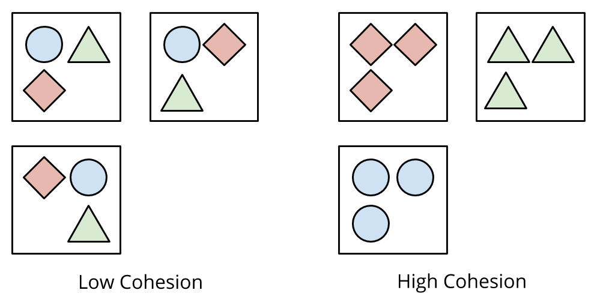

class: middle

# Built to Last

#### A domain-driven approach to beautiful systems

---

class: middle center

## Hi, I'm Andrew

Friendly neighborhood programmer at Carbon Five

---

class: middle center background-color-code


---

class: middle

### Welcome to your first day at Delorean!

It's so hot!

But systems are hard to work in.

1. Too many teams in one codebase
2. Changing a feature changes multiple codebases
3. Cruft and naming is not consistent with your product owner's terms

--

Will this system last?

---

## I've been thinking about beautiful systems

In the code - elegance, syntax, form, expressiveness

In the tooling - developer ergonomics

In the tests - test practices & coverage

--

More pragmatically - will it <strike>blend</strike> last?

???

I've oftentimes thought that beautiful systems were composed of the form
of the code - in its style, or in how developers would sit down and
interact with it, or in how well it sat in tests.

However, I've had the thought lately that a good measure of a beautiful
system is its longevity.

---

## Lasting systems - what they are

The system can live a long, productive life.

Flexible and easy to change, to adapt to changing biz requirements.

Easily maintained

Resistant to the Dreaded Rewrite

???

It's not throwaway, but like all systems, it's not overengineered with
the expectation that it must last forever

---

## Lasting systems - what they are not

So terrible, nobody wants to work in it.

So terrible, they cripple the business.

???

Lasting systems are NOT systems that are so crappy that you can't change
them, and so everybody avoids it and it lives forever like a nightmare.

Lasting systems are NOT systems that are so tangled that the business
literally cannot function without it. Unrescuable?

---

### Your Typical Rails Monolith, after about 3 years:

* Overflowing folders

[PLACEHOLDER]: sample code?

---

class: middle center

### An insight

"Systems decompose well when they hide [encapsulate] important information" - D.L. Parnas

---

class: middle

## Introducing Domain-Driven Design

DDD is both a set of high-level design activities and specific software patterns

???

First came out as a book in 2003: Domain Driven Design by Eric Evans.

It can be very confusing as it's got a lot of concepts and
enterprise-speak.

---

class: middle

## Our goals today

📖 **Agree upon a shared vocabulary** with our business partners

--

👓 **Visualize our system** from a domain perspective.

--

✏️ Learn insights to **draw boundaries** in our code!

--

🛠 Do a little bit of **refactoring**.

???

We'll learn to see the software from the business domain perspective

Visualization is important: you can't improve what you can't see!

This is a team exercise! If you're doing any of these alone by yourself
because you're the Lead, or the Architect, you're doing this wrong. This
is meant to be a communal, team-wide effort.

---

class: middle center

## Strategic Design

#### Through an exercise called Context Mapping

???

Everybody say "Strategic Design"

We are going to go through an exercise called Context Mapping.

---

### Problem statement

Systems too often become maintainable because there
is imprecise, lazy concepts between code and the business.

---

#### Apply It! ⚡️

## Step 0: Develop a Glossary

Get your business domain experts and technical staff together in a room
and build a definition list of the concepts and the actions in your
domain.

???

Domain-Driven Design hinges on precise language and terminology.

I know this probably isn't what you showed up for, but I want to drive
home the point that long-lasting, beautiful systems have precise terms
that dutifully map to real concepts in the business.

---

## Glossary

Nouns - concepts (a.k.a. entities)

Verbs - actions (a.k.a. events)

---

#### A sample glossary

Driver: [Entity] A customer equipped with a car, focusing on providing driver services

<strike>Passenger</strike> Participant: [Entity] A person seeking a ride to a
specified location.

HailedDriver: [Event] A user has signaled their intent to seek out a ride.

ChargedCreditCard: [Event] A customer credit card has been charged for a transaction.

???

Here's the interesting part - you may find yourself talking through the
intricacies of each model. Some of these may be assumed, emergent terms
you've developed over the years at your company. Good - the point is to
get it actually documented.

Another benefit we get here is the ability for new engineers and product
people to onboard quickly and get used to what your team does.

Now put this up on a wall, or on a wiki! Somewhere where the team can
continually reference in the future.

---

### Problem statement:

We often don't know how to refactor our systems
because we lack a high-level view of it.

---

#### Apply It! ⚡️

## Step 1: Visualize Your System

Let's generate an ERD diagram!

I like to generate mine with a gem like [`railroady`](https://github.com/preston/railroady) or
[`rails-erd`](https://github.com/voormedia/rails-erd)

If you have multiple systems, do this for each system.

---

class: middle center background-image-contain background-white

background-image: url(images/erd.png)

---

class: middle center

### Yikes.

---

## Core domain

The **Core Domain** is the thing that your business does that makes it unique.

--

Delorean Core Domain: **Transportation**

---

## Supporting domains

A **Supporting Domain** (or Subdomain) are the areas of the business
that play roles in making the **Core Domain** happen.

--

_Delorean Supporting Domains:_

* **Driver Routing** (route me from X to Y)

--
* **Notifications** (push notifications)

--
* **Financial Transactions** (charge the card)

--
* **Product Analytics** (track business metrics)

--
* **Customer Support** (keep people happy)

???

See anything interesting here? Most likely, these domains have a company
unit devoted to them.

In many companies, each of these organizational units have their own
dedicated engineering staff.

---

class: middle

#### Apply It! ⚡️

## Step 2: Draw domains on your diagram

Brainstorm a list of domains. They may either be emergent or predefined

Overlay your domains on top of the ERD diagram

You might discover some domains you never even thought you had!

???

Take out a pen, or whiteboard marker and draw areas of your
system that correspond to certain domains.

You may even see some domains you haven't thought of before!

---


class: middle center background-image-contain background-white

background-image: url(images/erd.png)

---

class: middle center background-image-contain background-white

background-image: url(images/erd-2-domains.jpg)

---

## Bounded Contexts

A **Bounded Context** is:

- Concretely: a software system (like a codebase)
- Linguistically: a delineation in your domain where concepts are "bounded", or contained

???

Remember, this is because we agreed that different domains may have
different concepts, and hence different Ubiqutious Languages.

---

#### Apply It! ⚡️

## Step 3: Overlay your bounded contexts

Next up - with a different color pen or marker, draw lines around system
boundaries / bounded contexts.

--

You may also find other system boundaries like:

* External cloud providers
* Other teams' services or systems

---

class: middle center background-image-contain background-white

background-image: url(images/erd-2-domains.jpg)

---

class: middle center background-image-contain background-white

background-image: url(images/erd-3-bounded-context-simplified.png)

---

class: middle center background-image-contain background-white

background-image: url(images/erd-4-bounded-context-extended.png)

---

## Congrats! You just made a Context Map!

A **Context Map** gives us a place to see the current system as-is (the
problem space), the strategic domains, and their dependencies.

---

## Making sense of the Context Map

We may notice a few things:

--

* One bounded context contains multiple sub-(supporting) domains

---

class: middle center background-image-contain background-white

background-image: url(images/erd-4-bounded-context-extended.png)

---

## Making sense of the Context Map

We may notice a few things:

* One bounded context contains multiple sub-(supporting) domains
* Multiple bounded contexts are required to support a single domain

???

Note upstream vs downstream dependencies. These are communication bottlenecks.

---

class: middle center background-image-contain background-white

background-image: url(images/erd-4-bounded-context-extended.png)

---

class: middle

## An Ideal Architecture

Each **Domain** should have its own **Bounded Context**

Key concept in DDD!

---

class: middle center background-image-contain background-white

background-image: url(images/erd-5-bounded-context-ideal.png)

---

class: middle

## Increased cohesion!

We just found the areas where code "naturally" fits together, because
they are serving the same business goal.


???

We just found the areas where code "naturally" fits together, because
they are serving the same business goal.

We will find that these entities naturally prefer each other, since
they live in the same organizational unit.

---

#### Apply It! ⚡️

## Break your application into domain modules

Incremental refactoring, using Ruby Modules to lead the way!

---

class: middle background-color-code

```ruby
class Trip < ActiveRecord::Base
  belongs_to :vehicle
  belongs_to :passenger
  belongs_to :driver
end

class TripsController < ApplicationController
  # ...
end
```

---

class: middle background-color-code

```ruby
module Ridesharing
  class Trip < ActiveRecord::Base
    belongs_to :vehicle
    belongs_to :passenger
    belongs_to :driver
  end
end

module Ridesharing
  class TripsController < ApplicationController
    # ...
  end
end
```

---

class: middle

#### Find references to newly modulized classes and change them.

---

class: middle background-color-code

```ruby
# config/routes.rb

resources :trips
```

---

class: middle background-color-code

```ruby
# config/routes.rb

namespace :ridesharing, path: '/' do
  resources :trips
end
```

---

class: middle background-color-code

```ruby
class Invoice
  belongs_to :trip
end
```

---

class: middle background-color-code

```ruby
class Invoice
  belongs_to :trip, class_name: Ridesharing::Trip
end
```

---

## Creating domain-oriented folders

```
app/domains/ridesharing/trip.rb
app/domains/ridesharing/service_tier.rb
app/domains/ridesharing/vehicle.rb
app/domains/ridesharing/trips_controller.rb
app/domains/ridesharing/trips/show.html.erb
```

---

class: middle center background-image-contain



---

class: middle center

## Hence: modulizing increases cohesion

#### Let's move on to coupling...

---

## ActiveRecord relationships can be abused!

Objects start knowing too much about the entire world.

"God Objects"

---

class: middle background-color-code

```ruby
class PaymentConfirmation
  belongs_to :trip, class_name: Ridesharing::Trip
  belongs_to :passenger, class_name: Ridesharing::Passenger
  belongs_to :credit_card
  has_many :menu_items
  belongs_to :coupon_code
  has_one :retriable_email_job
  # ad infinitum...
end
```

---

class: middle center background-image-contain background-white

background-image: url(images/aggregate-root-1.png)

---

class: middle

## Aggregate Roots

**Aggregate Roots** are top-level domain models that reveal an object
graph of related entities beneath them.

--

Can be considered a **Facade**

---

class: middle center background-image-contain background-white

background-image: url(images/aggregate-root-2.png)

---

## Decrease coupling by only exposing aggregate roots

Make it a rule in your system that you may only access another domain's
**Aggregate Root**.

--

Internally, it's OK to reach for whatever you need.

---

class: middle

## Make service objects that provide Aggregate Roots

Your source domain can provide a service (Adapter) that returns the
**Aggregate Root**

???

Ship these around when communicating between domains!

---

class: middle background-color-code

```ruby
module Ridesharing
  class FetchTrip
    def call(id)
      Trip
        .includes(:passenger,
                  :trip, ...)
        .find(id)
      # Alternatively, return something custom
      # OpenStruct.new(trip: Trip.find(id), ...)
    end
  end
end
```

---

class: middle background-color-code

```ruby
class PaymentConfirmation
  belongs_to :trip, class_name: Ridesharing::Trip
  belongs_to :passenger, class_name: Ridesharing::Passenger
  # ...
end
```

---

class: middle background-color-code

```ruby
class PaymentConfirmation
  def trip
    # Returns the Trip aggregate root
    Ridesharing::FetchTrip.new.find(payment_id)
  end
end

# OLD: payment_confirmation.passenger
# NEW: payment_confirmation.trip.passenger
```

---

class: middle

## Decrease coupling by publishing events for async dependencies

Domains that only need unidirectional data flow work well here!

---

class: middle

## Just send an event notifying the outside world!

Instead of needing to know about the outside world, we simply
publish an event.

---

class: middle background-color-code

```ruby
# Old way
class TripController
  def create
    # ...
    ReallySpecificGoogleAnalyticsThing
      .tag_manager_logging('trip_created',
                           ENV['GA_ID'],
                           trip)
  end
end
```

---

class: middle background-color-code

```ruby
class TripController
  def create
    # ...
    EventPublisher.publish(:trip_created, trip.id)
  end
end
```

---

## Conway's Law and DDD

Conway's Law, paraphrased: "Software systems tend to look like the
organizations that produce them"

--

DDD modeling oftentimes reveals domains that follow organizational
layouts.

Your software systems follow organizational optimizations.

--

Thus this is a very natural place to draw a seam!

???

The organization has optimized for communication within itself,
and has likely reduced its dependencies on other organizational units.

---

## Cohesion as a factor of business change

The Context Map helps you understand where change is most likely to
cluster - from the business functions that drive them.

Thus, we organize our code anticipating such change together.

---

## Systems thinking

Systems thinking is a process tool that forces us to think about our
systems as living, breathing organisms.

Systems built to last will take those factors into account - identifying
work producers, minimizing waste, increasing efficiencies, localising and clustering work.

---

## The evolution of this localised change...

1. Domain-oriented folders, to...
2. Rails engines, to...
3. Rails microservices with a shared AR gem and a message queue, to...
4. Fully-decoupled, polyglot microservices

Each of these evolutions is simply modeling a bounded context with
stronger seams!

"Component-Based Rails Applications" by Stephan Hagemann

---

## Warning: Limitations apply!

Don't try to do this on every project!

--

I've been guilty of overdesigning.

--

Try it out, step by step

--

Back it out if this doesn't "fit"

???

Here's what you can do: spike it out.
See how it feels and fits. Back it out if it doesn't work for you.

---

class: middle

## What we did tonight

👓 **Visualized our system** with a Context Map

✏️   **Drew boundaries** in our code!

🛠 Do a little bit of **refactoring** with domain modules, Aggregate
Roots and Domain Events.

---

class: middle

Sample code: [https://www.github.com/andrewhao/delorean](https://www.github.com/andrewhao/delorean)

---

class: middle

## Thanks!

Github: [andrewhao](https://www.github.com/andrewhao)

Twitter: [@andrewhao](https://www.twitter.com/andrewhao)

Email: [andrew@carbonfive.com](mailto:andrew@carbonfive.com)

---

## Prior Art

* W. P. Stevens ; G. J. Myers ; L. L. Constantine. ["Structured Design"](http://ieeexplore.ieee.org/document/5388187/) - IBM Systems Journal, Vol 13 Issue 2, 1974
* Evans, Eric. [Domain Driven Design](https://www.amazon.com/Domain-Driven-Design-Tackling-Complexity-Software/dp/0321125215)
* Vernon, Vaughan. [Implementing Domain-Driven Design](https://www.amazon.com/Implementing-Domain-Driven-Design-Vaughn-Vernon/dp/0321834577)
* http://www.win.tue.nl/~wstomv/quotes/structured-design.html#6
* https://www.infoq.com/articles/ddd-contextmapping
* http://gorodinski.com/blog/2013/04/29/sub-domains-and-bounded-contexts-in-domain-driven-design-ddd/
